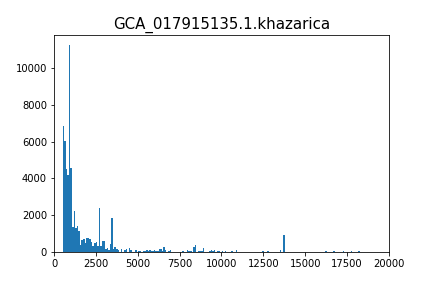
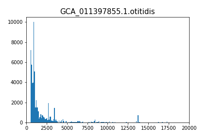
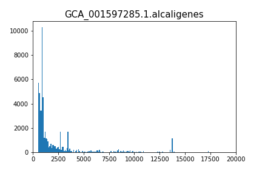
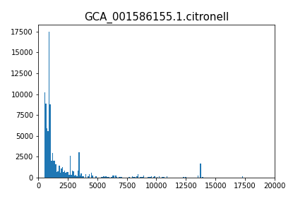

# hse22_project

# Общая информация
*Pseudomonas khazarica* - Gram-negative, aerobic, motile and rod-shaped bacterium with the potential to biodegrade polycyclic aromatic hydrocarbons, was isolated from Khazar (Caspian) Sea

*Pseudomonas furukawaii* - a polychlorinated biphenyl-degrading bacterium isolated from biphenyl-contaminated soil in Japan

*Pseudomonas citronellolis* -  bacillus bacterium that is used to study the mechanisms of pyruvate carboxylase

*Pseudomonas alcaligenes* - a Gram-negative aerobic bacterium used for bioremediation purposes of oil pollution, pesticide substances, and certain chemical substances, as it can degrade polycyclic aromatic hydrocarbons. It can be a human pathogen, but occurrences are very rare

*Pseudomonas otitidis* - a Gram-negative bacterium that causes otitis

# Сводная таблица

| Вид  |  Кол-во хромосом | Кол-во скаффолдов | Кол-во экзонов | Общая длина | Кол-во аннотированных генов | Процент генов в геноме| Кол-во предсказанных участков z-dna | Кол-во участков с zh-score > 500 | общая длина  |
|---|--|--|--|---|--|--|---|---|---|
| khazarica | 1 |  1 | 84 | 53841589| 5008 | 89.64 | 5384159 | 66516 | 656268 |
| furukawai  | 2 | 2  | 92 |6183134 | 5715 | 88.74 | 6183134 | 52084 | 512612 |
| citronellolis  | 1  | 1 | 86 | 6952896| 6155 | 86.23 | 6951444 | 98878 | 972094 |  
| alcaligenes  | 1 | 1  | 73 |4407084| 4142 | 91.23 | 4406305 | 56970 | 557766 |
| otitidis | 1  | 1 | 81 |6090915 | 5584 | 89.67 | 6089454 | 62615 | 624638 | 

# Гистограмма значений zh-score
|   |   |
|---|---|
|  |   |
|   |   |
|   |   |

# Z-ДНК и гомологичные гены разных организмов

Всего кластеров: 
 
