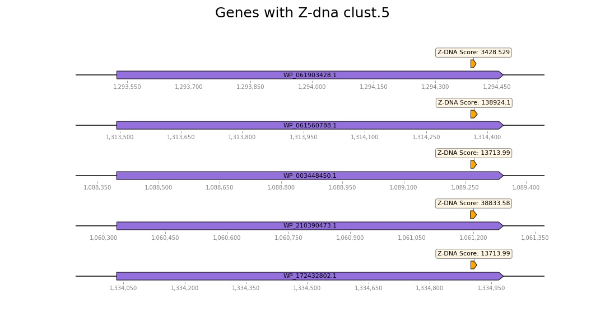
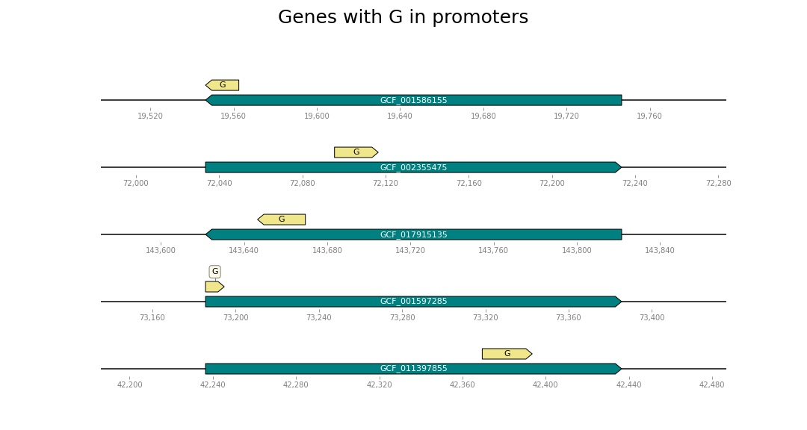

# hse22_project
Для анализа был выбран таксон Gammaproteobacteria, род Pseudomonas.


# Общая информация
*Pseudomonas khazarica* - Gram-negative, aerobic, motile and rod-shaped bacterium with the potential to biodegrade polycyclic aromatic hydrocarbons, was isolated from Khazar (Caspian) Sea

*Pseudomonas furukawaii* - a polychlorinated biphenyl-degrading bacterium isolated from biphenyl-contaminated soil in Japan

*Pseudomonas citronellolis* -  bacillus bacterium that is used to study the mechanisms of pyruvate carboxylase

*Pseudomonas alcaligenes* - a Gram-negative aerobic bacterium used for bioremediation purposes of oil pollution, pesticide substances, and certain chemical substances, as it can degrade polycyclic aromatic hydrocarbons. It can be a human pathogen, but occurrences are very rare

*Pseudomonas otitidis* - a Gram-negative bacterium that causes otitis

# Сводная таблица

| Вид  |  Кол-во хромосом | Кол-во скаффолдов | Кол-во экзонов | Общая длина | Кол-во аннотированных генов | Процент генов в геноме| Кол-во предсказанных участков z-dna | Кол-во участков с zh-score > 500 | общая длина  |
|---|--|--|--|---|--|--|---|---|---|
| khazarica | 1 |  1 | 84 | 53841589| 5008 | 89.64 | 5384159 | 66516 | 656268 |
| furukawai  | 2 | 2  | 92 |6183134 | 5715 | 88.74 | 6183134 | 52084 | 512612 |
| citronellolis  | 1  | 1 | 86 | 6952896| 6155 | 86.23 | 6951444 | 98878 | 972094 |  
| alcaligenes  | 1 | 1  | 73 |4407084| 4142 | 91.23 | 4406305 | 56970 | 557766 |
| otitidis | 1  | 1 | 81 |6090915 | 5584 | 89.67 | 6089454 | 62615 | 624638 | 

# Гистограмма значений zh-score
|   |   |
|---|---|
|  |   |
|   |   |
|   |   |

**Расположение Z - ДНК, до локализации в промотерах**


**Расположение Z - ДНК в промотерах**


# Z-ДНК и гомологичные гены разных организмов

Всего кластеров: 5565

|   |   |
|---|---|
| |  |

## Таблица с информацией по выбранным кластерам
<table>
<thead>
  
<tr>
<th>Название кластера</th>
<th>Кол-во генов</th>
<th>Гены</th>
<th>Функции генов</th>
<th>Расположение Z-ДНК</th>
<th>Z-Hunt score</th>
</tr>
  
</thead>
  
<tbody>
<tr>
<td rowspan=5>Cluster #1</td>
<td rowspan=5>5</td>
<td rowspan=1>WP_061904735.1</td>
<td rowspan=1>FGGY-family carbohydrate kinase</td>
<td rowspan=1>Промотор</td>
<td rowspan=1>211093.9</td>
</tr>
<tr>
<td rowspan=1>WP_048167316.1</td>
<td rowspan=1>FGGY-family carbohydrate kinase</td>
<td rowspan=1>Промотор</td>
<td rowspan=1>211093.9</td>
</tr>
<tr>
<td rowspan=1>WP_003456284.1</td>
<td rowspan=1>FGGY-family carbohydrate kinase</td>
<td rowspan=1>Промотор</td>
<td rowspan=1>2442.459</td>
</tr>
<tr>
<td rowspan=1>WP_134676250.1</td>
<td rowspan=1>FGGY-family carbohydrate kinase</td>
<td rowspan=1>Промотор</td>
<td rowspan=1>48804.94</td>
</tr>
<tr>
<td rowspan=1>WP_044405102.1</td>
<td rowspan=1>FGGY-family carbohydrate kinase</td>
<td rowspan=1>Промотор</td>
<td rowspan=1>6970.795</td>
</tr>
  
<tr>
<td rowspan=5>Cluster #2</td>
<td rowspan=5>5</td>
<td rowspan=1>WP_061903628.1</td>
<td rowspan=1>SufE family protein</td>
<td rowspan=1>Промотор / Тело гена</td>
<td rowspan=1>28780.5 / 6565.992</td>
</tr>
<tr>
<td rowspan=1>WP_061562515.1</td>
<td rowspan=1>SufE family protein</td>
<td rowspan=1>Промотор</td>
<td rowspan=1>138924.1</td>
</tr>
<tr>
<td rowspan=1>WP_004421065.1</td>
<td rowspan=1>SufE family protein</td>
<td rowspan=1>Промотор</td>
<td rowspan=1>28780.5</td>
</tr>
<tr>
<td rowspan=1>WP_210389447.1</td>
<td rowspan=1>SufE family protein</td>
<td rowspan=1>Промотор</td>
<td rowspan=1>1201.671</td>
</tr>
<tr>
<td rowspan=1>WP_172434466.1</td>
<td rowspan=1>SufE family protein</td>
<td rowspan=1>Промотор</td>
<td rowspan=1>138924.1</td>
</tr>

<tr>
<td rowspan=5>Cluster #3</td>
<td rowspan=5>5</td>
<td rowspan=1>WP_061902825.1</td>
<td rowspan=1>DeoR transcriptional regulator</td>
<td rowspan=1>Тело гена</td>
<td rowspan=1>13829.1</td>
</tr>
<tr>
<td rowspan=1>WP_009614568.1</td>
<td rowspan=1>DeoR transcriptional regulator</td>
<td rowspan=1>Тело гена</td>
<td rowspan=1>38833.58</td>
</tr>
<tr>
<td rowspan=1>WP_003457979.1</td>
<td rowspan=1>DeoR transcriptional regulator</td>
<td rowspan=1>Тело гена /  Тело гена</td>
<td rowspan=1>3428.529/ 3428.529</td>
</tr>
<tr>
<td rowspan=1>WP_03754754.1</td>
<td rowspan=1>DeoR transcriptional regulator</td>
<td rowspan=1> Тело гена</td>
<td rowspan=1>138924.1</td>
</tr>
<tr>
<td rowspan=1>WP_044409993.1</td>
<td rowspan=1>DeoR transcriptional regulator</td>
<td rowspan=1>Тело гена / Тело гена</td>
<td rowspan=1>1217.448 / 980.8116</td>
</tr>
  
<tr>
<td rowspan=5>Cluster #4</td>
<td rowspan=5>5</td>
<td rowspan=1>WP_061902613.1</td>
<td rowspan=1>dihydroxy-acid dehydratase</td>
<td rowspan=1>Промотор / Промотор</td>
<td rowspan=1>4270.735 / 883.5764</td>
</tr>
<tr>
<td rowspan=1>WP_043317516.1</td>
<td rowspan=1>dihydroxy-acid dehydratase</td>
<td rowspan=1>Промотор / Промотор</td>
<td rowspan=1>4270.735 / 883.5764</td>
</tr>
<tr>
<td rowspan=1>WP_003455761.1</td>
<td rowspan=1>dihydroxy-acid dehydratase</td>
<td rowspan=1>Тело гена</td>
<td rowspan=1>302785.5</td>
</tr>
<tr>
<td rowspan=1>WP_037055187.1</td>
<td rowspan=1>dihydroxy-acid dehydratase</td>
<td rowspan=1>Промотор /  Промотор</td>
<td rowspan=1>4270.735 / 883.5764</td>
</tr>
<tr>
<td rowspan=1>WP_172432347.1</td>
<td rowspan=1>dihydroxy-acid dehydratase</td>
<td rowspan=1>Тело гена / Тело гена</td>
<td rowspan=1>1493.421 / 766.6232</td>
</tr>
  
<tr>
<td rowspan=5>Cluster #4</td>
<td rowspan=5>5</td>
<td rowspan=1>WP_061902613.1</td>
<td rowspan=1>dihydroxy-acid dehydratase</td>
<td rowspan=1>Промотор / Промотор</td>
<td rowspan=1>4270.735 / 883.5764</td>
</tr>
<tr>
<td rowspan=1>WP_043317516.1</td>
<td rowspan=1>dihydroxy-acid dehydratase</td>
<td rowspan=1>Промотор / Промотор</td>
<td rowspan=1>4270.735 / 883.5764</td>
</tr>
<tr>
<td rowspan=1>WP_003455761.1</td>
<td rowspan=1>dihydroxy-acid dehydratase</td>
<td rowspan=1>Тело гена</td>
<td rowspan=1>302785.5</td>
</tr>
<tr>
<td rowspan=1>WP_037055187.1</td>
<td rowspan=1>dihydroxy-acid dehydratase</td>
<td rowspan=1>Промотор /  Промотор</td>
<td rowspan=1>4270.735 / 883.5764</td>
</tr>
<tr>
<td rowspan=1>WP_172432347.1</td>
<td rowspan=1>dihydroxy-acid dehydratase</td>
<td rowspan=1>Тело гена / Тело гена</td>
<td rowspan=1>1493.421 / 766.6232</td>
</tr>
  
<tr>
<td rowspan=5>Cluster #5</td>
<td rowspan=5>5</td>
<td rowspan=1>WP_061904954.1</td>
<td rowspan=1>hypothetical protein</td>
<td rowspan=1>Промотор / Промотор</td>
<td rowspan=1>1737.612 / 683.0489</td>
</tr>
<tr>
<td rowspan=1>WP_043271072.1</td>
<td rowspan=1>hypothetical protein</td>
<td rowspan=1>Промотор / Промотор / Тело гена</td>
<td rowspan=1>6420.008 / 1737.612 / 883.5764</td>
</tr>
<tr>
<td rowspan=1>WP_003453599.1</td>
<td rowspan=1>sel1 repeat family protein</td>
<td rowspan=1>Промотор / Промотор</td>
<td rowspan=1>904.32 / 1737.612</td>
</tr>
<tr>
<td rowspan=1>WP_210390646.1</td>
<td rowspan=1>SEL1-like repeat protein</td>
<td rowspan=1>Промотор</td>
<td rowspan=1>302785.5</td>
</tr>
<tr>
<td rowspan=1>WP_172432982.1</td>
<td rowspan=1>sel1 repeat family protein</td>
<td rowspan=1>Промотор</td>
<td rowspan=1>575.9058</td>
</tr>
  
  
<tr>
<td rowspan=5>Cluster #6</td>
<td rowspan=5>5</td>
<td rowspan=1>WP_061903428.1</td>
<td rowspan=1>D-alanine--D--alanine ligase</td>
<td rowspan=1>Тело гена</td>
<td rowspan=1>3428.529</td>
</tr>
<tr>
<td rowspan=1>WP_0611560788.1</td>
<td rowspan=1>D-alanine--D--alanine ligase</td>
<td rowspan=1>Тело гена</td>
<td rowspan=1>138924.1</td>
</tr>
<tr>
<td rowspan=1>WP_003448450.1</td>
<td rowspan=1>D-alanine--D--alanine ligase</td>
<td rowspan=1>Тело гена</td>
<td rowspan=1>13713.99</td>
</tr>
<tr>
<td rowspan=1>WP_210390473.1</td>
<td rowspan=1>D-alanine--D--alanine ligase</td>
<td rowspan=1>Тело гена</td>
<td rowspan=1>38833.58</td>
</tr>
<tr>
<td rowspan=1>WP_172432802.1</td>
<td rowspan=1>D-alanine--D--alanine ligase</td>
<td rowspan=1>Тело гена</td>
<td rowspan=1>13713.99</td>
</tr>
</tbody>
</table>

## Множественно белковое выравнивание
Файлы до Clustal и после приведены в папке *aligment*, также выровненные последовательности приведены ниже

<details>
<summary>Выравнивание для кластера №1</summary>

```
WP_061904735.1      MSEQRYLLAIDNGTQSVRALLFDLAGNLVGKGKVELEPYYSEHPGWAEQDPEYYWRSLGE	60
WP_134676250.1      MSEPSYLLSIDNGTQSVRALLFDTAGNLLAKGKVELDPYFSSQPGWAEQDPEYYWASLGE	60
WP_061561093.1      MSEQSYLLAIDNGTQSVRALLFDLAGNLVGKGKVELEAYYSSQPGWAEQDPEYYWAKLGE	60
WP_003456284.1      MSEKSYLLAIDNGTQSVRALLFDLDGNLVGKGKVPLEAYYSKQPGWAEQDPEYYWASLGE	60
WP_044405102.1      MSETSYLLAIDNGTQSVRALLFDLQGNLVGKGKVPLEAYYSKQPGWAEQDPDYYWSSLAE	60
                    ***  ***:**************  ***:.**** *: *:*.:********:*** .*.*

WP_061904735.1      ACRQLWASVDIDKSQIAGVSLTTQRGTLINVDEAGQPLRPAILWLDQRRAEVAGSIQGPW	120
WP_134676250.1      ACRLLWQQADIDRSLIRGVAVTTQRGSVIHVDEQGTPLRPAILWLDQRRAEVRERIKGPW	120
WP_061561093.1      ACQLLWAQSGIDRSLIRGVSLTTQRGTVIHVDGQGKPLRPAILWLDQRRAEVEGRIEGPW	120
WP_003456284.1      ACRRLWASVDIDRRQVRGVSLTTQRGTLINVDEQGQPLRPAILWLDQRQAEVRGRIKGPW	120
WP_044405102.1      ACRLLWASVDIDRSLIRGVALTTQRGTVIHVDEQGQPLRPAIIWLDQRRAEAEGRIKGPW	120
                    **: ** . .**:  : **::*****::*:**  * ******:*****:**.   *:***

WP_061904735.1      GWLFKLIREEETIDYFRSQAEACWIAQQQPEIWARTHKFLLLSGFLTHRLCGRFADSVGS	180
WP_134676250.1      GWLFKLARAEEAVDHFRGQAEVNWVAQQQPEIAARTHKVLLLSGFLTHRLCGRFVDSTSS	180
WP_061561093.1      GWLFKLAGAEGAVDYFRSQAEVNWVAQQQPELHAATHKVLLLSGFLTHRLCGRFVDSLAC	180
WP_003456284.1      GWLFRVARLEPTVDHFRAQAEVNWVAQHQPELWARTHKVLLLSGFLSHRLCGRFVDSVAC	180
WP_044405102.1      GWLFRLLRLEPTVDHFRTQAEVNWVAQNQPELWARTHKVLLLSGFLTHRLCGRFVDSVGC	180
                    ****::   * ::*:** ***. *:**:***: * ***.*******:*******.** ..

WP_061904735.1      CVAYLPFDYKRLCWAKPSDWKWQAIPVRPDMLPELVKPGERIGAISAEASRHTGIPEGLP	240
WP_134676250.1      CVAYLPFDYKRLCWAAPRDWKWQALAVRREQLPELFKPGERLGSISAQASRHTGIPEGLP	240
WP_061561093.1      SVAYLPFDYKRLKWAAPRDWKWQAVKVRQEQLPELFKPGAKLGAISAEASRHTGIPEGLP	240
WP_003456284.1      QVAYLPFDYKGLRWAAPRDWKWQAMPVRPQQLPELYKPGAELGRITAEASRHTGIPEGLP	240
WP_044405102.1      QVAYLPFDYKRLDWAKPSDWKWQAMPVRREQLPDLCKPGETLGRITAEASRLTGIPEGLP	240
                     ********* * ** * ******: ** : **:* ***  :* *:*:*** ********

WP_061904735.1      LIAAASDKACEVIGAGGVEPSTACLSYGTTATINTTRAQYLETIPLIPPYPAAIPDHYNT	300
WP_134676250.1      LIAAGADKACEVLGSGALDASTACLSYGTTATINTTRSRYLETIALIPPYPAALPDHFNT	300
WP_061561093.1      LIAAGADKACEVLGAGAIEPSVACLSYGTTATINTTRARYLETIPLIPPYPAAIPDHFNT	300
WP_003456284.1      LIAAGADKACEVLGAGGVEPSVACLSYGTTATINTTRRQYLETIPLIPPYPAAIPDHFNT	300
WP_044405102.1      LVAAAADKACEVMGSGGVAPDTACLSYGTTATINTTRQRYLETIPLIPPYPAAVPDHFNT	300
                    *:**.:******:*:*.:  ..*************** :***** ********:***:**

WP_061904735.1      EVMVFRGFWMVSWFKEQFGHAERQRGLELGVEAETLFDELVESVPPGAMGLMLQPFWSPG	360
WP_134676250.1      EVMIYRGFWMVSWFKREFGLREMQRAEALGVAPEALFDELVNAVPPGSMGLMLQPYWTPG	360
WP_061561093.1      EVMIYRGFWMVSWFKREFGLREMQRAAELGVEPEKLFDELVEQVPPGSMGLMLQPYWTPG	360
WP_003456284.1      EVMIYRGFWMVSWFKQEFGLREMQRAQELGVEPEALFDELVNSVPPGSMGLMLQPYWSPG	360
WP_044405102.1      EVMIYRGFWMVSWFKQEFGLREMQRARELGVEPEALFDELVNGVPPGSMGLTLQPYWSPG	360
                    ***::**********.:**  * **.  ***  * ******: ****:*** ***:*:**

WP_061904735.1      IREPGLEAKGSIIGFGDVHTRAHLYRAILEGLAYALRQGREKIERRSGTRIQRLRISGGG	420
WP_134676250.1      IREPGLEAKGSIIGFGDVHTRAHLYRAILEGLAYALRQGKERIEKRAGTPIRRLRVSGGG	420
WP_061561093.1      IREPGLEAKGAVIGFGDVHTRAHLYRAILEGLAYALRQGKERIEKRSGTRIERLRVAGGG	420
WP_003456284.1      IREPGLEAKGSIIGFGDVHTRAHLYRAILEGLAYALRQGKEQIERRSGTAITRLRVSGGG	420
WP_044405102.1      IREPGLEAKGSIIGFGDVHTRAHIYRAILEGLAYALRQGKERIEKRSGTRITRLRVSGGG	420
                    **********::***********:***************:*:**:*:** * ***::***

WP_061904735.1      SQSDAAMQLTADIFNLPAERPHLYETSGLGAAIDCAVGLGLHPDFPAAIAAMTRVGKVFQ	480
WP_134676250.1      SQSDAAMQLTADIFGLPAERPHLYETSGLGAAINCAVGLGLHADYAAAIAAMTRVGQVFE	480
WP_061561093.1      SQSDAAMQLTADIFGLPAERPHVYEASGLGAAIDCAVGLGLFPDFAAAIAAMTRVGQVFQ	480
WP_003456284.1      SQSDAAMQLTADIFGLPAERPHVYETSGLGAAIDCAVGLGLHPDFTTAIGAMTRVGRVFE	480
WP_044405102.1      SQSDAAMQLTADIFGLPAERPHVFETSGLGAAIDCAVGLGLHPDFPTAIAAMTRVGQVFQ	480
                    **************.*******::*:*******:*******. *: :**.******:**:
```
</details>

<details>
<summary>Выравнивание для кластера №2</summary>

```
WP_004421065.1      MTLSDNAQAALEAFTAAGSWEQRARLLMQWGERLDPLGDGERGDANRVHGCESQVWLVGE	60
WP_172434466.1      MNLPPQATEALAAFGAAGSWEQRARLLMQWGERLEPLSDIERSEANRVHGCESQVWLVEE	60
WP_061903628.1      MTLPTAAHEALDAFAACPGWEQRARLLMQWGERLQPLTDAERSEANRVDGCDSLVWLVAE	60
WP_061562515.1      MSLPEAARQALEAFAGQASWEQRARLLMQWGDRLEPLDESERSEANRIHGCESLVWLVAE	60
WP_210389447.1      MSLPGAAQEAFDAFTTCHGWEQRARLLMQWGERLAPLSDAERSEANRVHGCESLVWLLAE	60
                    *.*   *  *: **    .************:** ** : **.:***:.**:* ***: *

WP_004421065.1      RTDDRWRFRAASDARLIRGLLAVLLARVNGMTEAELAGVDLADWFNQLGLARQLSPSRSN	120
WP_172434466.1      IKEGHRHFRAASDARLIRGLLAVLLARVQGLAREELATLDLSDWFTQLGLSRQLSPSRTN	120
WP_061903628.1      RRGEAWHFRAASEARLIRGLLAVLLTRIDGLGAEQLAELDLPTWFDQLGLARQLSPSRAN	120
WP_061562515.1      QRDGAWHFRATSDARLLRGLIALLLVRVQGLPGEELAQLDLGQWFNELGLGRQLSPSRSN	120
WP_210389447.1      QHEGRWRFRATSDARLLRGLLAVLLARVEGLSSNELAQLDLNDWFNQLGLQRQLSPSRSN	120
                          :***:*:***:***:*:**.*::*:   :** :**  ** :*** *******:*

WP_004421065.1      GLNAVLKKMAELAQA---	135
WP_172434466.1      GLNAVLDRMRKAAP----	134
WP_061903628.1      GLNAVLQRMRELAKARQD	138
WP_061562515.1      GLNAVLQRMRELVS----	134
WP_210389447.1      GLHAVLRRMAELTS----	134
                    **:*** :* : .     
```
</details>

<details>
<summary>Выравнивание для кластера №3</summary>

```
 WP_009614568.1      MSKRNTPQRRHEILALLNQQGEVSVDDLARRFATSEVTIRKDLAALESNGLLLRRYGGAV	60
WP_003457979.1      MSKRNTPQRRHAILALLAEQGEVSVDALAKAFATSEVTIRKDLAALEANGLLLRRYGGAV	60
WP_044409993.1      MSKRNTPQRRHAILALLAEQGEVSVDALAKAFATSEVTIRKDLAALEANGLLLRRYGGAV	60
WP_061902825.1      MSKRNTPQRRHAILALLNEQGEVFVDALAQHFATSEVTIRKDLAELEKNGLLLRRYGGAV	60
WP_037054754.1      MSKRNTPQRRHTILALLAEQGEVSVDALAQHFATSEVTIRKDLAALEKNGLLLRRYGGAV	60
                    *********** ***** :**** ** **: ************* ** ************

WP_009614568.1      PMPQELLAEPSPPLSPYKQAIARAAAACIREHARIIIDSGSTTAALIPELGHKPGLVVMT	120
WP_003457979.1      PVPQEFMVEASQPVSRYKQAIARAAVGCIREHARIIIDSGSTTAAMIPELGHKPGLVVMT	120
WP_044409993.1      PVPQEFISETSQPVSRYKQAIARAAAERIREHARIIVDSGSTTAALIPELGHRPGLVVMT	120
WP_061902825.1      PMPQELIGEPAQPISRHKQAIARAAVGLIREHARIIIDSGSTTAAMIPQLGRQPGLVVMT	120
WP_037054754.1      PMPQELIGDGAQPVSPHKQAIARAGVARIREHARIIIDSGTTTAAMIPQLGHRPGLVVMT	120
                    *:***:: : : *:* :*******..  ********:***:****:**:**::*******

WP_009614568.1      NSLNVANALRELEREPVLLMTGGTWDPHSESFQGQVAEQVLRSYDFDQLFIGAAGLDPAR	180
WP_003457979.1      NSLSVANALRELEHEPVLLMTGGTWDPHSESFQGQVAEQVLRSYDFDQLFIGADGIDLDR	180
WP_044409993.1      NSLNVATALRELEHEPVLLMTGGTWDPHSESFQGQVAEQVLRSYDFDQLFIGADGIDLAR	180
WP_061902825.1      NSLNVANALRDIEHEPVLLMTGGTWDPHSESFQGQVAEQVLRSYDFDQLFIGADGIDLER	180
WP_037054754.1      NSLNVANALRDIEHEPVLLMTGGTWDPHSESFQGQVAEQVLRSYDFDQLFIGADGIDLER	180
                    ***.**.***::*:*************************************** *:*  *

WP_009614568.1      GTTTFNELLGLSRVMAEVAREVIVMAEADKLGRRMPNLELPWSSIQTLITDERLSDEACA	240
WP_003457979.1      GTTTFNELLGLSRVMAEVAREVIVMAEADKLGRRIPNLELPWSSIHTLITDERLALDARE	240
WP_044409993.1      GTTTFNELLGLSRVMAEVAREVIVMAEADKVGRRIPNLELPWSSIHTLITDERLPQDARQ	240
WP_061902825.1      GTTTFNELLGLSRVMAEVAREVIVMVESDKVGRRIPNLELPWSSVHTLITDDRLDSQVAE	240
WP_037054754.1      GTTTFNELLGLSRVMAEVAREVIVMVESDKIGRRIPNLELPWSSVHTLITDERLDAQAAE	240
                    *************************.*:**:***:*********::*****:**  :.  

WP_009614568.1      QIEARGVKVIRARCTN	256
WP_003457979.1      QIAARGIKLICASID-	255
WP_044409993.1      QIEARGITLVCAPVDN	256
WP_061902825.1      QIRARGVQLILAAAS-	255
WP_037054754.1      QIRARGIQLILAPLEN	256
                    ** ***: :: *     
```
</details>

<details>
<summary>Выравнивание для кластера №4</summary>

```
WP_037055187.1      MPDYRSKTSTHGRNMAGARALWRATGMKDEDFKKPIIAIANSFTQFVPGHVHLKDLGQLV	60
WP_003455761.1      MPDYRSKTSTHGRNMAGARALWRATGMKDEDFKKPIIAIANSFTQFVPGHVHLKDLGQLV	60
WP_172432347.1      MPDYRSKTSTHGRNMAGARALWRATGMKDEDFKKPIIAIANSFTQFVPGHVHLKDLGQLV	60
WP_061902613.1      MPDYRSKTSTHGRNMAGARALWRATGMKDEDFKKPIIAIANSFTQFVPGHVHLKDLGQLV	60
WP_043317516.1      MPDYRSKTSTHGRNMAGARALWRATGMKDEDFKKPIIAIANSFTQFVPGHVHLKDLGQLV	60
                    ************************************************************

WP_037055187.1      AREIEKAGGVAKEFNTIAVDDGIAMGHDGMLYSLPSREIIADSVEYMVNAHCADAIVCIS	120
WP_003455761.1      AREIEKHGGVAKEFNTIAVDDGIAMGHDGMLYSLPSREIIADSVEYMVNAHCADAIVCIS	120
WP_172432347.1      AREIEKHGGVAKEFNTIAVDDGIAMGHDGMLYSLPSREIIADSVEYMVNAHCADAIVCIS	120
WP_061902613.1      AREIEKHGGVAKEFNTIAVDDGIAMGHDGMLYSLPSREIIADSVEYMVNAHCADAIVCIS	120
WP_043317516.1      AREIEKAGGVAKEFNTIAVDDGIAMGHDGMLYSLPSREIIADSVEYMVNAHCADAIVCIS	120
                    ****** *****************************************************

WP_037055187.1      NCDKITPGMLMAALRLNIPVVFVSGGPMEAGKTKLASHGLDLVDAMVIAADSSASDEKVA	180
WP_003455761.1      NCDKITPGMLMAALRLNIPVVFVSGGPMEAGKTKLANHGLDLVDAMVAAADDSCSDEKVA	180
WP_172432347.1      NCDKITPGMLMAALRLNIPVVFVSGGPMEAGKTKLANHGLDLVDAMVVAADDSCSDEKVA	180
WP_061902613.1      NCDKITPGMLMAALRLNIPVVFVSGGPMEAGKTKLASHGLDLVDAMVVAADDSCSDEKVA	180
WP_043317516.1      NCDKITPGMLMAALRLNIPVVFVSGGPMEAGKTKLASHGLDLVDAMVVAADDSCSDEKVA	180
                    ************************************.********** ***.*.******

WP_037055187.1      EYERSACPTCGSCSGMFTANSMNCLTEALGLSLPGNGSTLATHSDREQLFLRAGRLAVEL	240
WP_003455761.1      EYERSACPTCGSCSGMFTANSMNCLTEALGLSLPGNGSTLATHADREQLFLRAGRLAVEL	240
WP_172432347.1      EYERSACPTCGSCSGMFTANSMNCLTEALGLSLPGNGSTLATHSDREQLFLRAGRLAVEL	240
WP_061902613.1      EYERSACPTCGSCSGMFTANSMNCLTEALGLSLPGNGSTLATHSDREQLFLRAGRLAVEL	240
WP_043317516.1      EYERSACPTCGSCSGMFTANSMNCLTEALGLSLPGNGSTLATHADREQLFLRAGRLAVEL	240
                    *******************************************:****************

WP_037055187.1      CQRYYGEGDESVLPRNIANFKAFENAMMLDIAMGGSTNTILHLLAAAQEGEVAFDLRDID	300
WP_003455761.1      CQRYYGEGDESVLPRNIASFKAFENAMTLDIAMGGSTNTILHLLAAAQEAEIDFDLRDID	300
WP_172432347.1      CQRYYGEGDASVLPRNVASFKAFENAMTLDIAMGGSTNTILHLLAAAQEAEVAFDLRDID	300
WP_061902613.1      CQRYYGEGDESVLPRNVASFKAFENAMTLDIAMGGSTNTILHLLAAAQEAEIAFDLRDID	300
WP_043317516.1      CQRYYGEGDESVLPRNVASFKAFENAMTLDIAMGGSTNTILHLLAAAQEAEIAFDLRDID	300
                    ********* ******:*.******** *********************.*: *******

WP_037055187.1      RLSRKVPQLCKVAPNIQKYHMEDVHRAGGIFSILGELARGGLLHTDVHTVHSPNMAEAIA	360
WP_003455761.1      RLSRKVPQLCKVAPNIQKYHMEDVHRAGGIFSILGELARGGLLHTDVPTVHSPSMADAIA	360
WP_172432347.1      RLSRKVPQLCKVAPNIQKYHMEDVHRAGGIFSILGELARGGLLHTDVPTVHSPSMADAIA	360
WP_061902613.1      RLSRKVPQLCKVAPNIQKYHMEDVHRAGGIFSILGELARGGLLHTDVPTVHSPSMAEAIA	360
WP_043317516.1      RLSRKVPQLCKVAPNIQKYHMEDVHRAGGIFSILGELARGGLLHTDVPTVHSPSMADAIA	360
                    *********************************************** *****.**:***

WP_037055187.1      QWDITQTQDEAVHHFFKAGPAGIPTQTAFSQSTRWDSLDDDRAEGCIRSVEHAYSQEGGL	420
WP_003455761.1      QWDITQTDDEAVHTFFKAGPAGIPTQVAFSQSTRWDSLDDDRENGCIRSVEHAYSQEGGL	420
WP_172432347.1      QWDITQTDDEAVHTFFKAGPAGIPTQVAFSQSTRWDSLDDDRANGCIRSVEHAYSQEGGL	420
WP_061902613.1      QWDITQTNDEKVHTFFKAGPAGIPTQTAFSQSTRWETLDDDRAEGCIRSVEHAYSQEGGL	420
WP_043317516.1      QWDITQTRDEAVHTFFKAGPAGIPTQTAFSQNTRWPSLDDDRAEGCIRSVEHAYSAEGGL	420
                    ******* ** ** ************.****.*** :***** :*********** ****

WP_037055187.1      AVLYGNIALDGCVVKTAGVDESIHVFEGTAKVFESQDSAVKGILADEVKAGDIVIIRYEG	480
WP_003455761.1      AVLYGNIALDGCVVKTAGVDESIHVFEGTAKIFESQDAAVKGILSDEVKPGDVVVIRYEG	480
WP_172432347.1      AVLYGNIALDGCVVKTAGVDESIHVFEGTAKIFESQDGAVKGILADKVKPGDIVIIRYEG	480
WP_061902613.1      AVLYGNIALDGCVVKTAGVDESIHVFEGNAKIFESQDSAVKGILADEVKPGDIVIIRYEG	480
WP_043317516.1      AVLYGNIALDGCVVKTAGVDESIHVFEGSAKIFESQDAAVKGILADEVKPGDIVIIRYEG	480
                    ****************************.**:*****.******:*:** **:*:*****

WP_037055187.1      PKGGPGMQEMLYPTSYLKSKGLGKACALLTDGRFSGGTSGLSIGHASPEAASGGAIGLVQ	540
WP_003455761.1      PKGGPGMQEMLYPTSYLKSKGLGKQCALLTDGRFSGGTSGLSIGHASPEAAAGGAIGLVQ	540
WP_172432347.1      PKGGPGMQEMLYPTSYLKSKGLGKQCALLTDGRFSGGTSGLSIGHASPEAAAGGAIGLVQ	540
WP_061902613.1      PKGGPGMQEMLYPTSYLKSKGLGKQCALLTDGRFSGGTSGLSIGHASPEAAAGGAIGLVQ	540
WP_043317516.1      PKGGPGMQEMLYPTSYLKSKGLGKQCALLTDGRFSGGTSGLSIGHASPEAAAGGAIGLVK	540
                    ************************ **************************:*******:

WP_037055187.1      DGDKILIDIPNRSINLLVSDEELAKRRSEQDQKGWKPAAPRARKVTTALKAYALLATSAD	600
WP_003455761.1      DGDKIHIDIHNRTIQLLVSDEELSHRRHVQEKKGWKPAAPRARKVTTALKAYALLATSAD	600
WP_172432347.1      DGDKVLIDIPNRSINLLVSDEELATRRAEQDKKGWKPAQPRARKVSTALKAYALLATSAD	600
WP_061902613.1      DGDKVLIDIPNRSINLLVSDEELAKRRAEQDKKGWKPVAPRARKVSTALKAYALLATSAD	600
WP_043317516.1      DGDKVLIDIPNRSINLLVSDEELAARRIEQDKKGWKPAQPRARRVSTALKAYALLATSAD	600
                    ****: *** **:*:********: **  *::*****. ****:*:**************

WP_037055187.1      KGAVRNKALLDG-	612
WP_003455761.1      KGAVRNKAMLEG-	612
WP_172432347.1      KGAVRNKAMLEDL	613
WP_061902613.1      KGAVRDKALLDG-	612
WP_043317516.1      KGAVRNKALLDG-	612
                    *****:**:*:. 
```
</details>

<details>
<summary>Выравнивание для кластера №5</summary>

```
WP_003453599.1      ----MFWPLRARIGYRVARWLMRFRSLVSNPRSWRWMQGQYARMAALGDRDAQSFYGHLL	56
WP_172432982.1      ---MAIWKLRAWLGYAVARWLLRFPSLVRNPRAWNWMQGQYARQANLGNIAAQRFYGHLL	57
WP_043271072.1      MSREFVWRLRARLSYAMARRLMGWPWLVRQPRAWQWMQGQFSRMANLGDVAAQSFYGHLL	60
WP_061904954.1      ----MLWPVRARLGYWLARRLFHWRWLLQQPRAWAWMQGQYARMAALGHVPAQSFYGHIL	56
WP_210390646.1      -MSRLLWQVRARLGYWLARRLFHWSWTLRQPRLWQWMQGQYGRMANLGDTPAQSFYGHIL	59
                         .* :** :.* :** *: :   : :** * *****:.* * **.  ** ****:*

WP_003453599.1      LHRGQGLGARDEGIRLLRLAAGAGDGKSAYQLGVLSLDGDARQAPDAAQAARWWELAAER	116
WP_172432982.1      LHRGQGFGAREEGIRLLRLAGQAGDGKSAYQLGVLALAGDARQAPDAAQAAHWWSLAEQA	117
WP_043271072.1      LFRGQGFGAREEGLRLLALAAAGGDAKAAYQLGVQALQGSAQRQPDGAAAARHWAQAAEA	120
WP_061904954.1      LFRGQGFGVREEGLRLLRLAAQGGDGKAAYQVGVQVLAGDSRQAADAAEAARWWVMAADA	116
WP_210390646.1      LFRGQGLGAREEGLRLLRLAASGGDGKAAYQLGVQALQGDTRQAPDGVQAVRWWEMALAA	119
                    *.****:*.*:**:*** **. .**.*:***:**  * *.:::  *.. *.: *  *   

WP_003453599.1      GHPLAARKLVELYRAGGPGLVPDAAAAERAEMRASRLGF----	155
WP_172432982.1      GHPLAARKLADLYREGGPGLAADVEAAERLDRRAAQLGL----	156
WP_043271072.1      GHPLAARRLAELYRDGAEGLAADAEQAERYQALAARLGL----	159
WP_061904954.1      GHPLAAQRLSQLYRDGGPGLAADAAQAERFAHRAEQLGLRPKG	159
WP_210390646.1      GHPLAARRLSQVYLDGAPGVTPDRALAEQHAALAQETQASAG-	161
                    ******::* ::*  *. *:. *   **:    * .  
```
</details>

<details>
<summary>Выравнивание для кластера №6</summary>

```
WP_172432802.1      MTDHLKSTVPPSAFGRVAVLYGGRSAEREVSLKSGSMVLEALLSAGVDAFGIDVGDDFLQ	60
WP_061903428.1      --MSLHSTLDPKAFGRVAVLFGGKSAERAVSLKSGAAVLEALQSAGVDAFGIDVGDDFLQ	58
WP_210390473.1      --MSLHSTLDPKAFGRVAVLFGGKSAEREVSLKSGNAVLGALQAAGVDAFGIDVGDDFLQ	58
WP_061560788.1      MNDALKSTLEPRAFGRVAVLYGGRSAEREVSLKSGGMVLKALQDAGVDAFGIDVGDDLLQ	60
WP_003448450.1      MSAKLMSTLEPAAFGRVAVLYGGKSAEREVSLKSGAMVLQALQAAGVDAFGIDVGDDLLQ	60
                        * **: * ********:**:**** ******  ** **  *************:**

WP_172432802.1      RLSSERIDRAFIVLHGRGGEDGSMQGLLECLGIPYTGSGVLASALAMDKLRTKQVWHSLG	120
WP_061903428.1      RLTSERIDRAFIVLHGRGGEDGSMQGLLECAGIPYTGSGILASALAMDKLRTKRVWLSLG	118
WP_210390473.1      RLGREKIDRAFIVLHGRGGEDGSMQGLLECAGIPYTGSGILASALAMDKLRTKQVWHSLG	118
WP_061560788.1      RLLSEKIDRAFIILHGRGGEDGSMQGLLEVAGIPYTGSGVLASALAMDKLRTKRVWLSLG	120
WP_003448450.1      RLQAEKIDRAFIILHGRGGEDGSMQGLLECLGIPYTGSGILASALAMDKLRTKQLWNSLG	120
                    **  *:******:****************  ********:*************::* ***

WP_172432802.1      LPTPRHAVLASVEDCERAARELGFPLIVKPAHEGSSIGMAKVEDVDALVNAWRDASRYDP	180
WP_061903428.1      LPTPAHATLASEEDCHAAAAGLGFPLFVKPAHEGSSIGMAKVADVEALIAAWKDASRYDS	178
WP_210390473.1      LPTPRHAVLTSPADCEAAAAELGFPLIVKPAHEGSSIGMAKVDSAQALLAAWQDAARYDS	178
WP_061560788.1      LPTPAYAVLASGDDCRRAATELGFPLIVKPAHEGSSIGMAKVDGVDALIAAWRSAAEYDS	180
WP_003448450.1      LPTPRHGVLASEADCRQAANKLGFPLIVKPAHEGSSIGMAKVESVEALIEAWRAAATYDS	180
                    **** :..*:*  **. **  *****:*************** ..:**: **: *: ** 

WP_172432802.1      QVLVEQWIHGPEFTIAVLRGEVLPPIRLGTPHTFYDYEAKYLASDTRYQIPCGLDAEKEA	240
WP_061903428.1      QVLVEQMIDGPEYTVAMLRGQVLPPIGLGTPHTFYDYDAKYLANDTQYRIPCGLSADKEA	238
WP_210390473.1      QVLVEQWIAGPEYTIAVLRGEVLPPIGLGTPHSFYDYDAKYLADDTQYRIPCGLSAEKEA	238
WP_061560788.1      QVLVEQWISGPEFTVATLRGQVLPAIGLGTPHSFYDYDAKYLASDTQYRIPCGLSPEKER	240
WP_003448450.1      QVLVEQWIQGPEFTVAWLRGEVLPPIRLGTPHTFYDYDAKYLASDTRYQIPCGLEADKEE	240
                    ****** * ***:*:* ***:*** * *****:****:*****.**:*:*****. :** 

WP_172432802.1      ELKSLTALACEAVGTQGWARADVMQDAEGRFWLLEVNTVPGMTDHSLVPMAARAVGLDYQ	300
WP_061903428.1      ELKALTARACEAVGTQGWARADVMQDANGQFWLLEVNTVPGMTDHSLVPMAARAAGLDFQ	298
WP_210390473.1      ELKDLTARACDAVGTQGWARADVMQDASGQFWLLEVNTVPGMTDHSLVPMAARAAGLDFQ	298
WP_061560788.1      ELQDLCARACEALGIQGWGRTDVMQDAEGRFWLLEVNTAPGMTDHSLVPMAARAAGLDFQ	300
WP_003448450.1      ELKLLTARACETLGIQGWARADVMQDAEGRFWLLEVNTAPGMTDHSLVPMAARAAGLDFQ	300
                    **: * * **:::* ***.*:******.*:********.***************.***:*

WP_172432802.1      QLVLAVLADSVEARG	315
WP_061903428.1      QLVLAILADSVEARG	313
WP_210390473.1      QLVLAILADSVEARG	313
WP_061560788.1      QLVLAILADSVEARG	315
WP_003448450.1      HLVLAILADSVEARG	315
                    :****:*********
```
</details>

## Визуализация расположения Z - ДНК для кластеров
|   |
|---|
|  |
|  | 
|   |
|  |
|  | 
|   |

# Предсказание G-квадруплексов

## G квадруплексы в промотерах


## Множественно белковое выравнивание
Файлы до Clustal и после приведены в папке *G aligment*

 
## Визуализация расположения G для кластеров
|   |
|---|
|  |
|  | 
|  |  
  
